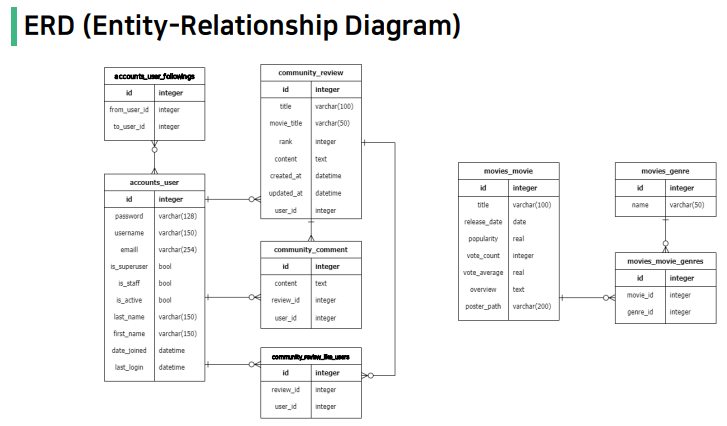
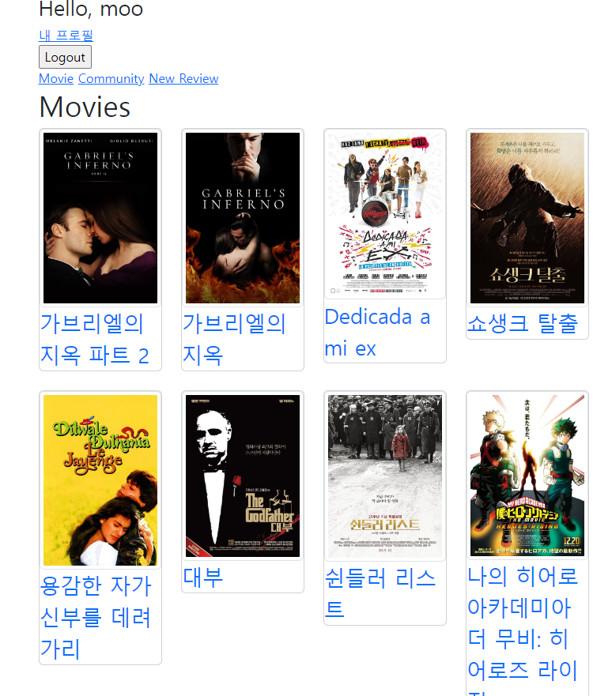

# 무 & 섭의 8번째 프로젝트

#### 김송섭(main driver)
- 평소에 옆자리 팀원분과 간략하게 의견을 주고 받으며 페어코딩과 비슷한 경험을 한 적은 있지만 이렇게 체계적으로 규칙을 정해놓고 하는 페어코딩은 처음이었습니다.
- 각자의 역할을 정해놓고, 바꾸어가면서 서로의 역할에 대한 이해와 어떻게하면 서로에게 힘이 되는 지 느낄 수 있었습니다.
- 최근에 Vue를 배우며 Django에 대해 소홀해졌지만 이번 복습 프로젝트를 통해서 다시 한 번 상기할 수 있는 기회를 가질 수 있었습니다.

#

#### 정무남(main navigator)
- 오랜만에 다시 장고를 사용하여 프로젝트를 하니 까먹은 부분이 많아서 힘들었지만 힘을 합치니까 혼자 프로젝트를 하는것 보다 여러 문제들을 더 쉽게 해결할 수 있었음
- 장고에서 여러 데이터들이 이동하는 흐름과 데이터를 주고받는 방법을 복습함
- 동기 비동기에 대해 복습할 수 있었음
- 기능만 구현하는 것이 아니라 부트스트랩을 이용하여 페이지를 꾸미는 방법을 오랜만에 사용하여 웹 관련 언어를 복습함
- ManyToManyField 관계에 있는 데이터를 가져와서 사용하는 방법을 배움
- 내가 말로만 표현한 것들을 옆에 동료가 구현해 주는게 신기하기도 하고 재미있는 경험이였음

## ERD

### 요구사항
- 유저 팔로우 기능
- 리뷰 좋아요 기능
- Moives 앱 기능
	- 전체 영화 목록 조회
	- 단일 영화 상세 조회
	- 영화 추천 기능
- ~~댓글 좋아요 및 대댓글 기능~~

### 결과

#